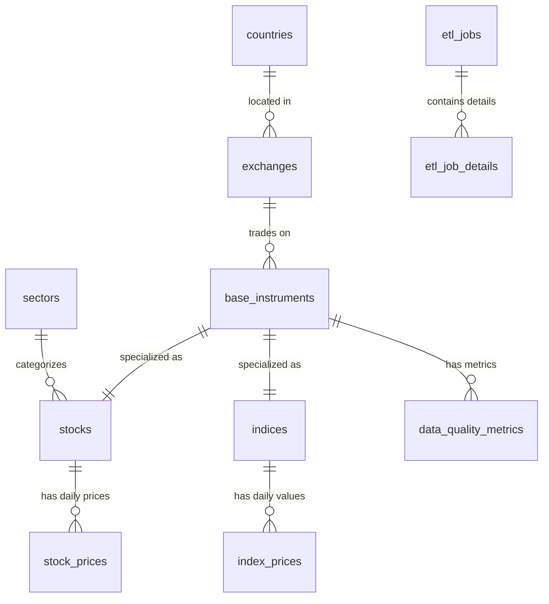

# Stock Growth Classification for Trading


A production-ready ETL pipeline for extracting, transforming, and loading Polish stock market data with automated scheduling, data quality validation, and comprehensive monitoring.

> **📚 Developer Resources**: For detailed technical documentation, architecture decisions, and development guidance, see **[CLAUDE.md](CLAUDE.md)**. This file contains comprehensive information about the codebase structure, essential commands, database design patterns, Airflow DAG configuration, and trading calendar integration.

## 🎯 Project Overview

This project implements a robust data pipeline that:
- **Extracts** financial data from Stooq API for Polish Stock Exchange (WSE)
- **Transforms** and validates data using Pydantic models
- **Loads** into a normalized PostgreSQL database with full audit trails
- **Orchestrates** daily operations using Apache Airflow with trading calendar integration
- **Monitors** data quality and ETL job performance

### 🏗️ Architecture

```
┌─────────────────┐    ┌─────────────────┐    ┌─────────────────┐
│   Stooq API     │───▶│  ETL Pipeline   │───▶│  PostgreSQL 17  │
│  (Data Source)  │    │   (Python)      │    │ (Normalized DB) │
└─────────────────┘    └─────────────────┘    └─────────────────┘
                                │
                                ▼
                       ┌─────────────────┐
                       │ Apache Airflow  │
                       │  (Scheduling)   │
                       └─────────────────┘
```

## 📊 Data Model

The system uses a **normalized database design** following 3NF/BCNF principles:



### Key Tables
- **Financial Data**: `stock_prices`, `index_prices` with OHLCV data
- **Instruments**: `base_instruments`, `stocks`, `indices` with metadata
- **ETL Tracking**: `etl_jobs`, `etl_job_details`, `data_quality_metrics`
- **Reference Data**: `countries`, `exchanges`, `sectors`, `data_sources`

## 🚀 Quick Start

### Prerequisites
- **Python 3.12+**
- **Docker & Docker Compose**
- **WSL2** (for Windows users)

### 1. Installation

```bash
# Clone repository
git clone https://github.com/KonuTech/classify-stock-growths-for-trading.git
cd classify-stock-growths-for-trading

# Install dependencies using uv (recommended)
uv sync

# Or using pip
pip install -e .
```

### 2. Start Infrastructure

```bash
# Start PostgreSQL and Airflow containers
docker-compose up -d

# Wait for services to be ready
docker-compose logs -f postgres  # Wait for "ready to accept connections"
```

### 3. Initialize Database

```bash
# Initialize development environment with sample data
stock-etl database init-dev

# Initialize clean test environment
stock-etl database init-test

# Test database connectivity
stock-etl database test-connection --schema dev_stock_data
```

### 4. Run ETL Pipeline

```bash
# Extract sample Polish market data
stock-etl extract sample --output-dir data --delay 2.0

# Load data into development database
stock-etl load sample --schema dev_stock_data

# Run complete pipeline (extract + load)
stock-etl pipeline --schema dev_stock_data
```

### 5. Access Airflow Dashboard

Open http://localhost:8080 in your browser:
- **Username**: `admin`
- **Password**: `u8Zt2hYnsqXM4MNw` (auto-generated)

## 📋 CLI Commands

The project provides a comprehensive command-line interface for all operations:

### Database Management

```bash
# Database initialization
stock-etl database init-dev          # Create dev schema with dummy data
stock-etl database init-test         # Create clean test schema
stock-etl database test-connection   # Test database connectivity

# Schema targeting
stock-etl database init-dev --schema custom_schema_name
```

### Data Extraction

```bash
# Extract predefined sample data (5 stocks + 4 indices)
stock-etl extract sample --output-dir data --delay 2.0

# Extract specific symbols
stock-etl extract symbol XTB --type stock --output-dir data
stock-etl extract symbol WIG --type index --output-dir data

# Batch extraction with rate limiting
stock-etl extract sample --delay 2.0  # 2-second delay between requests
```

### Data Loading

```bash
# Load sample data to specified schema
stock-etl load sample --schema dev_stock_data

# Load specific symbols
stock-etl load symbol XTB --type stock --schema test_stock_data
stock-etl load symbol WIG --type index --schema test_stock_data

# Load with validation
stock-etl load sample --schema test_stock_data --validate
```

### Full Pipeline Operations

```bash
# Complete ETL pipeline (extract + load)
stock-etl pipeline --schema dev_stock_data

# Pipeline with specific date range (for backfills)
stock-etl pipeline --schema prod_stock_data --start-date 2024-01-01 --end-date 2024-12-31
```

## 🔧 Configuration

### Environment Variables

Create a `.env` file or set environment variables:

```bash
# Database Configuration
DB_HOST=localhost
DB_PORT=5432
DB_NAME=stock_data
DB_USER=postgres
DB_PASSWORD=postgres

# ETL Configuration
DEFAULT_SCHEMA=dev_stock_data
STOOQ_RATE_LIMIT=2.0
LOG_LEVEL=INFO

# Airflow Configuration
AIRFLOW__CORE__DAGS_FOLDER=/opt/airflow/dags
AIRFLOW__CORE__LOAD_EXAMPLES=False
```

### Supported Markets & Instruments

**Polish Stock Exchange (WSE) Stocks:**
- `XTB` - X-Trade Brokers Dom Maklerski S.A.
- `PKN` - PKN Orlen S.A.
- `CCC` - CCC S.A.
- `LPP` - LPP S.A.
- `CDR` - CD Projekt S.A.

**Polish Market Indices:**
- `WIG` - WIG Index (main market index)
- `WIG20` - WIG20 (top 20 companies)
- `MWIG40` - mWIG40 (mid-cap companies)
- `SWIG80` - sWIG80 (small-cap companies)

## 🧪 Testing

### Database Testing

```bash
# Test database connectivity
stock-etl database test-connection --schema test_stock_data

# Initialize clean test environment
stock-etl database init-test

# Run pipeline on test data
stock-etl pipeline --schema test_stock_data
```

### Sample Data Validation

```bash
# Extract and validate sample data
python test_etl.py

# Check logs for validation results
tail -f logs/etl_debug.log
```

### Data Quality Verification

```bash
# Connect to database and verify data
docker-compose exec postgres psql -U postgres -d stock_data

# Check record counts
SET search_path TO dev_stock_data;
SELECT 'Stock Prices' as table_name, count(*) FROM stock_prices
UNION ALL
SELECT 'Index Prices', count(*) FROM index_prices
UNION ALL
SELECT 'ETL Jobs', count(*) FROM etl_jobs;

# Verify OHLC relationships
SELECT symbol, trading_date_local, 
       CASE WHEN high_price >= GREATEST(open_price, close_price) 
            AND low_price <= LEAST(open_price, close_price)
            THEN 'VALID' ELSE 'INVALID' END as ohlc_check
FROM stock_prices sp
JOIN stocks s ON sp.stock_id = s.id
JOIN base_instruments bi ON s.instrument_id = bi.id
ORDER BY trading_date_local DESC LIMIT 10;
```

## 🔍 Airflow Integration

### DAG Overview

The unified `stock_etl_unified_pipeline` DAG provides:

- **Trading Calendar Integration**: Automatic weekend/holiday detection using Polish trading calendar
- **Backfill Support**: Historical data processing with date range validation
- **Schema Targeting**: Environment-specific deployment (dev/staging/prod)
- **Comprehensive Monitoring**: ETL job tracking with detailed metrics
- **Data Quality Validation**: Automated OHLC validation and anomaly detection

### DAG Configuration

```python
# DAG parameters (configurable via Airflow UI)
{
    "schema": "dev_stock_data",      # Target database schema
    "mode": "incremental",           # incremental | backfill
    "instruments": "all",            # all | specific symbols
    "data_sources": "stooq",         # Data source configuration
    "enable_validation": true,       # Enable data quality checks
    "batch_size": 50                 # Processing batch size
}
```

### Manual DAG Execution

```bash
# Trigger DAG via CLI
docker-compose exec airflow airflow dags trigger stock_etl_unified_pipeline \
  --conf '{"schema": "dev_stock_data", "mode": "incremental"}'

# Test specific date
docker-compose exec airflow airflow dags test stock_etl_unified_pipeline "2025-08-15" \
  --conf '{"schema": "dev_stock_data", "mode": "backfill"}'
```

## 📈 Monitoring & Observability

### ETL Job Tracking

The system provides comprehensive monitoring through database tables:

```sql
-- View recent ETL jobs
SELECT job_name, status, records_processed, records_inserted, 
       started_at, completed_at, duration_seconds
FROM etl_jobs 
ORDER BY started_at DESC LIMIT 10;

-- Check job details by instrument
SELECT j.job_name, jd.symbol, jd.operation, jd.records_count, jd.processing_time_ms
FROM etl_jobs j
JOIN etl_job_details jd ON j.id = jd.job_id
WHERE j.status = 'completed'
ORDER BY j.started_at DESC;

-- Data quality metrics
SELECT instrument_id, metric_name, metric_value, is_valid, severity
FROM data_quality_metrics 
WHERE created_at >= CURRENT_DATE - INTERVAL '7 days'
  AND is_valid = FALSE;
```

### Structured Logging

All operations use structured JSON logging:

```bash
# View real-time logs
tail -f logs/etl_debug.log | jq '.'

# Filter by log level
grep '"level": "error"' logs/etl_debug.log | jq '.'

# Monitor specific operations
grep '"event": "data_extraction"' logs/etl_debug.log | jq '.symbol, .records_count'
```

### Airflow Monitoring

Access Airflow UI at http://localhost:8080 for:
- **DAG Run History**: Success/failure rates and duration trends
- **Task Logs**: Detailed execution logs for each pipeline step
- **Connection Health**: Database connectivity status
- **SLA Monitoring**: Configurable alerts for pipeline delays

## 🏗️ Development

### Code Quality

```bash
# Format code
black stock_etl/ tests/

# Lint code
ruff check stock_etl/ tests/

# Type checking
mypy stock_etl/

# Run tests
pytest tests/ -v --cov=stock_etl
```

### Development Setup

```bash
# Install development dependencies
uv sync --group dev

# Pre-commit hooks (optional)
pre-commit install

# Run development database
docker-compose up -d postgres
stock-etl database init-dev
```

### Contributing

1. **Fork the repository**
2. **Create feature branch**: `git checkout -b feature/new-feature`
3. **Run tests**: `pytest tests/`
4. **Check code quality**: `black . && ruff check . && mypy stock_etl/`
5. **Commit changes**: `git commit -m "Add new feature"`
6. **Push branch**: `git push origin feature/new-feature`
7. **Create Pull Request**

## 🐳 Docker Services

### Service Overview

| Service | Port | Purpose | Health Check |
|---------|------|---------|--------------|
| PostgreSQL | 5432 | Database storage | `pg_isready -U postgres` |
| Airflow | 8080 | Workflow orchestration | HTTP endpoint check |

### Container Management

```bash
# Start all services
docker-compose up -d

# View service logs
docker-compose logs -f postgres
docker-compose logs -f airflow

# Restart services
docker-compose restart

# Stop all services
docker-compose down

# Reset database (removes all data)
docker-compose down -v
docker volume prune -f
```

### Database Access

```bash
# Connect to PostgreSQL directly
docker-compose exec postgres psql -U postgres -d stock_data

# Execute SQL files
docker-compose exec postgres psql -U postgres -d stock_data -f /sql/schema_template.sql

# Database backup
docker-compose exec postgres pg_dump -U postgres stock_data > backup.sql

# Database restore
docker-compose exec -T postgres psql -U postgres -d stock_data < backup.sql
```

## 📊 Performance & Scalability

### Database Optimization

The schema includes comprehensive indexing for optimal query performance:

```sql
-- High-performance price queries
CREATE INDEX idx_stock_prices_stock_date ON stock_prices(stock_id, trading_date_local DESC);
CREATE INDEX idx_index_prices_index_date ON index_prices(index_id, trading_date_local DESC);

-- ETL monitoring indexes
CREATE INDEX idx_etl_jobs_status ON etl_jobs(status);
CREATE INDEX idx_etl_jobs_started_epoch ON etl_jobs(started_at_epoch);

-- Data quality indexes
CREATE INDEX idx_data_quality_invalid ON data_quality_metrics(is_valid) WHERE is_valid = FALSE;
```

### Connection Pooling

SQLAlchemy connection pooling is configured for optimal performance:

```python
# Database connection configuration
pool_size=10          # Base connection pool size
max_overflow=20       # Additional connections under load
pool_pre_ping=True    # Verify connections before use
pool_recycle=3600     # Recycle connections every hour
```

### Rate Limiting

Stooq API requests are rate-limited to prevent blocking:

```python
# Default configuration
delay_between_requests = 2.0  # 2-second delay
max_retries = 3              # Retry failed requests
backoff_factor = 2           # Exponential backoff
```

## 🔒 Security & Best Practices

### Database Security

- **Connection encryption**: TLS/SSL enabled for production
- **User privileges**: Least privilege access controls
- **Password management**: Environment variable configuration
- **SQL injection prevention**: Parameterized queries only

### Data Validation

- **Input validation**: Pydantic models validate all external data
- **Business rules**: OHLC price relationship validation
- **Duplicate detection**: Hash-based deduplication
- **Type safety**: Strict typing with mypy

### Error Handling

- **Graceful degradation**: Pipeline continues on single instrument failures
- **Comprehensive logging**: All errors logged with context
- **Retry mechanisms**: Automatic retry with exponential backoff
- **Monitoring alerts**: Data quality violations logged and tracked

## 📚 Additional Resources

### Documentation
- **[Database ERD](docs/erd-normalized-approach.md)**: Detailed schema documentation with Mermaid diagrams
- **[CLAUDE.md](CLAUDE.md)**: Development guidance and architectural decisions
- **[Progress Summary](.claude/progress-summary.md)**: Detailed implementation progress

### External APIs
- **[Stooq API](https://stooq.com)**: Polish stock market data source
- **Rate limits**: ~60 requests per minute (respect usage guidelines)
- **Data format**: CSV with Date,Open,High,Low,Close,Volume columns

### Production Deployment
- **Environment isolation**: Separate dev/staging/prod schemas
- **Backup strategy**: Daily automated PostgreSQL backups
- **Monitoring**: Integration with Prometheus/Grafana (planned)
- **Scaling**: Horizontal scaling via Airflow workers

---

## 🎯 Production Status

✅ **Database Schema**: Fully normalized design with comprehensive validation  
✅ **ETL Pipeline**: Production-tested with 58,470+ real market records  
✅ **Airflow Integration**: Complete DAG with trading calendar support  
✅ **Container Infrastructure**: PostgreSQL 17 + Airflow 3.0.4 ready  
✅ **CLI Interface**: Full command-line management capabilities  
✅ **Monitoring**: Comprehensive ETL job tracking and data quality metrics  

**Last Validation**: August 2025 with live Polish market data  
**Success Rate**: 100% (0 failures in production testing)

---

*Built with ❤️ for robust financial data processing*