# ERD: Normalized Approach (Expert B)

## Database Schema Overview
This diagram shows the normalized design with separate tables for different instrument types, following 3NF/BCNF principles.

```mermaid
erDiagram
    countries ||--o{ exchanges : "located in"
    exchanges ||--o{ base_instruments : "trades on"
    sectors ||--o{ stocks : "categorizes"
    base_instruments ||--|| stocks : "specialized as"
    base_instruments ||--|| indices : "specialized as"
    base_instruments ||--|| futures : "specialized as"
    base_instruments ||--|| options : "specialized as"
    stocks ||--o{ stock_prices : "has daily prices"
    indices ||--o{ index_prices : "has daily values"
    futures ||--o{ future_prices : "has daily prices"
    options ||--o{ option_prices : "has daily prices"
    stocks ||--o{ options : "underlies"
    data_sources ||--o{ etl_jobs : "sources data for"
    etl_jobs ||--o{ etl_job_details : "contains details"
    base_instruments ||--o{ data_quality_metrics : "has metrics"
    
    countries {
        SERIAL id PK
        VARCHAR(100) name
        VARCHAR(3) iso_code
        VARCHAR(3) currency_code
        VARCHAR(50) timezone
    }
    
    exchanges {
        SERIAL id PK
        VARCHAR(100) name
        VARCHAR(4) mic_code "Market Identifier Code"
        INTEGER country_id FK
        VARCHAR(50) timezone
        TIME market_open
        TIME market_close
        BOOLEAN is_active
    }
    
    sectors {
        SERIAL id PK
        VARCHAR(100) name
        VARCHAR(500) description
        VARCHAR(50) classification_system "GICS/ICB/etc"
    }
    
    base_instruments {
        SERIAL id PK
        VARCHAR(20) symbol
        VARCHAR(255) name
        instrument_type instrument_type "stock/index/future/option"
        INTEGER exchange_id FK
        VARCHAR(3) currency
        BOOLEAN is_active
        DATE first_trading_date
        DATE last_trading_date
        TIMESTAMPTZ created_at
        BIGINT created_at_epoch
        TIMESTAMPTZ updated_at
        BIGINT updated_at_epoch
    }
    
    stocks {
        SERIAL id PK
        INTEGER instrument_id FK
        VARCHAR(255) company_name
        INTEGER sector_id FK
        BIGINT market_cap
        BIGINT shares_outstanding
        DECIMAL_5_4 dividend_yield
        DECIMAL_8_2 pe_ratio
        DECIMAL_8_2 book_value
        VARCHAR(10) stock_type "common/preferred"
    }
    
    indices {
        SERIAL id PK
        INTEGER instrument_id FK
        VARCHAR(100) methodology "price_weighted/market_cap/etc"
        DECIMAL_15_6 base_value
        DATE base_date
        INTEGER constituent_count
        VARCHAR(20) calculation_frequency "real_time/end_of_day"
        VARCHAR(100) index_family "WIG/S&P/etc"
    }
    
    futures {
        SERIAL id PK
        INTEGER instrument_id FK
        INTEGER underlying_instrument_id FK
        DATE expiry_date
        DECIMAL_15_6 contract_size
        DECIMAL_10_4 tick_size
        VARCHAR(50) settlement_type "physical/cash"
        INTEGER margin_requirement
    }
    
    options {
        SERIAL id PK
        INTEGER instrument_id FK
        INTEGER underlying_stock_id FK
        CHAR(1) option_type "C/P for Call/Put"
        DECIMAL_10_4 strike_price
        DATE expiry_date
        INTEGER contract_size
        VARCHAR(20) exercise_style "american/european"
    }
    
    stock_prices {
        BIGSERIAL id PK
        INTEGER stock_id FK
        DATE trading_date_local
        DATE trading_date_utc
        BIGINT trading_date_epoch
        DECIMAL_15_6 open_price
        DECIMAL_15_6 high_price
        DECIMAL_15_6 low_price
        DECIMAL_15_6 close_price
        BIGINT volume
        DECIMAL_15_6 adjusted_close
        DECIMAL_8_4 split_factor
        DECIMAL_8_4 dividend_amount
        TIMESTAMPTZ created_at
        BIGINT created_at_epoch
    }
    
    index_prices {
        BIGSERIAL id PK
        INTEGER index_id FK
        DATE trading_date_local
        DATE trading_date_utc
        BIGINT trading_date_epoch
        DECIMAL_15_6 open_value
        DECIMAL_15_6 high_value
        DECIMAL_15_6 low_value
        DECIMAL_15_6 close_value
        BIGINT trading_volume
        DECIMAL_20_2 total_market_cap
        INTEGER constituents_traded
        TIMESTAMPTZ created_at
        BIGINT created_at_epoch
    }
    
    future_prices {
        BIGSERIAL id PK
        INTEGER future_id FK
        DATE trading_date_local
        DATE trading_date_utc
        BIGINT trading_date_epoch
        DECIMAL_15_6 open_price
        DECIMAL_15_6 high_price
        DECIMAL_15_6 low_price
        DECIMAL_15_6 close_price
        INTEGER volume
        INTEGER open_interest
        DECIMAL_15_6 settlement_price
        TIMESTAMPTZ created_at
        BIGINT created_at_epoch
    }
    
    option_prices {
        BIGSERIAL id PK
        INTEGER option_id FK
        DATE trading_date_local
        DATE trading_date_utc
        BIGINT trading_date_epoch
        DECIMAL_8_4 bid_price
        DECIMAL_8_4 ask_price
        DECIMAL_8_4 last_price
        INTEGER volume
        INTEGER open_interest
        DECIMAL_6_4 implied_volatility
        DECIMAL_6_4 delta
        DECIMAL_6_4 gamma
        DECIMAL_6_4 theta
        DECIMAL_6_4 vega
        TIMESTAMPTZ created_at
        BIGINT created_at_epoch
    }
    
    etl_jobs {
        BIGSERIAL id PK
        VARCHAR(100) job_name
        VARCHAR(50) job_type
        instrument_type target_instrument_type
        job_status status
        INTEGER data_source_id FK
        TIMESTAMPTZ started_at
        BIGINT started_at_epoch
        TIMESTAMPTZ completed_at
        BIGINT completed_at_epoch
        INTEGER duration_seconds
        INTEGER records_processed
        INTEGER records_inserted
        INTEGER records_updated
        INTEGER records_failed
        TEXT error_message
        JSONB metadata
    }
    
    etl_job_details {
        BIGSERIAL id PK
        BIGINT job_id FK
        INTEGER instrument_id FK
        VARCHAR(20) operation "insert/update/skip/error"
        DATE date_processed
        BIGINT date_processed_epoch
        INTEGER records_count
        TEXT error_details
        INTEGER processing_time_ms
        TIMESTAMPTZ created_at
        BIGINT created_at_epoch
    }
    
    data_quality_metrics {
        BIGSERIAL id PK
        BIGINT job_id FK
        INTEGER instrument_id FK
        instrument_type instrument_type
        DATE metric_date
        BIGINT metric_date_epoch
        VARCHAR(100) metric_name
        DECIMAL_15_6 metric_value
        DECIMAL_15_6 threshold_min
        DECIMAL_15_6 threshold_max
        BOOLEAN is_valid
        severity_level severity
        TEXT description
        TIMESTAMPTZ created_at
        BIGINT created_at_epoch
    }
    
    data_sources {
        SERIAL id PK
        VARCHAR(100) name
        VARCHAR(500) base_url
        VARCHAR(50) source_type "api/file/ftp"
        BOOLEAN api_key_required
        INTEGER rate_limit_per_minute
        VARCHAR(50) data_format
        VARCHAR(50) default_timezone
        BOOLEAN is_active
        TIMESTAMPTZ last_successful_fetch
        BIGINT last_successful_fetch_epoch
    }
```



## Key Benefits of Normalized Approach

### Data Integrity Advantages
- **Type-Specific Constraints**: Each instrument type has appropriate validation rules
- **Referential Integrity**: Proper foreign key relationships prevent orphaned data
- **Business Rule Enforcement**: Stock-specific vs index-specific business logic
- **No NULL Pollution**: Each table contains only relevant attributes

### Flexibility and Extensibility
- **Easy Expansion**: New instrument types don't affect existing tables
- **Type-Specific Optimization**: Indexes and queries optimized per instrument type
- **Clear Data Lineage**: Explicit relationships make data flow transparent
- **Independent Evolution**: Each instrument type can evolve independently

### Example Queries
```sql
-- Type-specific optimized query for stocks
SELECT 
    s.company_name,
    sec.name as sector,
    sp.close_price,
    sp.volume
FROM stocks s
JOIN base_instruments bi ON s.instrument_id = bi.id
JOIN sectors sec ON s.sector_id = sec.id
JOIN stock_prices sp ON s.id = sp.stock_id
WHERE sp.trading_date_local = CURRENT_DATE
    AND s.market_cap > 1000000000;

-- Index methodology analysis
SELECT 
    i.methodology,
    COUNT(*) as index_count,
    AVG(ip.close_value) as avg_value
FROM indices i
JOIN index_prices ip ON i.id = ip.index_id
WHERE ip.trading_date_local >= CURRENT_DATE - INTERVAL '30 days'
GROUP BY i.methodology;

-- Options Greeks analysis (impossible in unified design)
SELECT 
    o.strike_price,
    o.option_type,
    op.delta,
    op.gamma,
    op.implied_volatility
FROM options o
JOIN option_prices op ON o.id = op.option_id
JOIN stocks s ON o.underlying_stock_id = s.id
JOIN base_instruments bi ON s.instrument_id = bi.id
WHERE bi.symbol = 'XTB'
    AND o.expiry_date > CURRENT_DATE
    AND op.trading_date_local = CURRENT_DATE;
```

## Normalization Benefits

### Third Normal Form (3NF) Compliance
- **No Transitive Dependencies**: All non-key attributes depend only on primary keys
- **Atomic Values**: Each column contains single, indivisible values
- **No Redundancy**: Information stored in exactly one place

### BCNF (Boyce-Codd Normal Form) Compliance
- **Proper Functional Dependencies**: Every determinant is a candidate key
- **No Update Anomalies**: Changes require updates in only one place
- **No Insertion Anomalies**: Can add new data without requiring unrelated information

### Performance Considerations
```sql
-- Optimized indexes per table type
CREATE INDEX idx_stock_prices_date_stock ON stock_prices(stock_id, trading_date_local);
CREATE INDEX idx_index_prices_date_index ON index_prices(index_id, trading_date_local);
CREATE INDEX idx_stocks_sector ON stocks(sector_id);
CREATE INDEX idx_stocks_market_cap ON stocks(market_cap) WHERE market_cap > 0;

-- Partitioning strategy per instrument type
-- Stock prices partitioned by year
CREATE TABLE stock_prices_2024 PARTITION OF stock_prices
FOR VALUES FROM ('2024-01-01') TO ('2025-01-01');

-- Index prices partitioned differently (longer retention)
CREATE TABLE index_prices_2020_2024 PARTITION OF index_prices
FOR VALUES FROM ('2020-01-01') TO ('2025-01-01');
```

## Future Extensibility Examples

### Adding Cryptocurrency Support
```sql
CREATE TABLE cryptocurrencies (
    id SERIAL PRIMARY KEY,
    instrument_id INTEGER REFERENCES base_instruments(id),
    blockchain VARCHAR(50) NOT NULL,
    total_supply DECIMAL(30,8),
    circulating_supply DECIMAL(30,8),
    consensus_mechanism VARCHAR(20), -- PoW/PoS/etc
    block_time_seconds INTEGER
);

CREATE TABLE crypto_prices (
    id BIGSERIAL PRIMARY KEY,
    crypto_id INTEGER REFERENCES cryptocurrencies(id),
    trading_date_local DATE NOT NULL,
    trading_date_utc DATE NOT NULL,
    trading_date_epoch BIGINT NOT NULL,
    open_price DECIMAL(20,8) NOT NULL,
    high_price DECIMAL(20,8) NOT NULL,
    low_price DECIMAL(20,8) NOT NULL,
    close_price DECIMAL(20,8) NOT NULL,
    volume_24h DECIMAL(30,8),
    market_cap DECIMAL(30,2),
    UNIQUE(crypto_id, trading_date_local)
);
```

### Adding Bond Support
```sql
CREATE TABLE bonds (
    id SERIAL PRIMARY KEY,
    instrument_id INTEGER REFERENCES base_instruments(id),
    issuer_name VARCHAR(255) NOT NULL,
    coupon_rate DECIMAL(6,4),
    maturity_date DATE NOT NULL,
    face_value DECIMAL(15,2),
    credit_rating VARCHAR(10),
    bond_type VARCHAR(20) -- government/corporate/municipal
);
```

This normalized approach provides a solid foundation for a comprehensive financial data system that can grow and adapt to new requirements while maintaining data integrity and optimal performance.