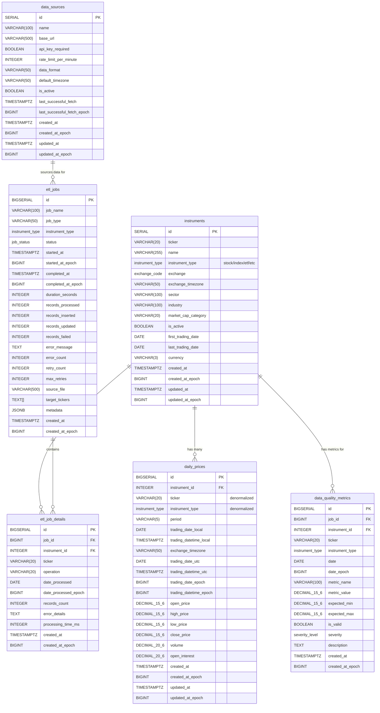

# ERD: Unified Approach (Expert A)

## Database Schema Overview
This diagram shows the unified table design where stocks and indices share the same table structure with `instrument_type` discriminator.



## Key Benefits of Unified Approach

### Performance Advantages
- **Single Table Queries**: All price data in one table enables fast cross-instrument analysis
- **Optimized Indexing**: Composite indexes on `(ticker, trading_date_local)` serve all queries
- **Reduced JOIN Complexity**: No need for UNION operations across stock/index tables
- **Memory Locality**: Related data (stocks and indices) in same table pages

### Operational Benefits
- **Simplified ETL**: One pipeline handles all instrument types
- **Consistent Schema**: Same validation rules and constraints across all instruments
- **Easy Maintenance**: Single backup/recovery strategy
- **Unified Analytics**: Cross-asset correlation analysis in single queries

### Example Queries
```sql
-- Compare stock performance against index
SELECT 
    s.ticker as stock,
    i.ticker as index,
    s.close_price / LAG(s.close_price) OVER (ORDER BY s.trading_date_local) - 1 as stock_return,
    i.close_price / LAG(i.close_price) OVER (ORDER BY i.trading_date_local) - 1 as index_return
FROM daily_prices s
JOIN daily_prices i ON s.trading_date_local = i.trading_date_local
WHERE s.ticker = 'XTB' AND i.ticker = 'WIG'
ORDER BY s.trading_date_local;

-- Sector performance analysis
SELECT 
    i.sector,
    AVG(dp.close_price / LAG(dp.close_price) OVER (PARTITION BY dp.ticker ORDER BY dp.trading_date_local) - 1) as avg_return
FROM instruments i
JOIN daily_prices dp ON i.id = dp.instrument_id
WHERE i.instrument_type = 'stock'
    AND dp.trading_date_local >= CURRENT_DATE - INTERVAL '30 days'
GROUP BY i.sector;
```

## Index Strategy
```sql
-- Critical indexes for performance
CREATE INDEX idx_daily_prices_ticker_date ON daily_prices(ticker, trading_date_local);
CREATE INDEX idx_daily_prices_instrument_date ON daily_prices(instrument_id, trading_date_local);
CREATE INDEX idx_daily_prices_type_date ON daily_prices(instrument_type, trading_date_local DESC);
CREATE INDEX idx_instruments_type_active ON instruments(instrument_type, is_active);
```